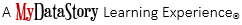

```{r setup, include=FALSE}
knitr::opts_chunk$set(echo = TRUE)
```



<script src="hideOutput.js"></script>

<link rel="stylesheet" type="text/css" href="fold.css">

```{r, include = FALSE}
## Save the data
cats_orig <- data.frame(coat = factor(c("calico", "black", "tabby")),
                   weight = c(2.1, 5.0, 3.2),
                   likes_string = c(1, 0, 1))

cats_bad <- data.frame(coat = factor(c("calico", "black", "tabby", "tabby")),
                   weight = factor(c(2.1, 5.0, 3.2, '2.3 or 2.4')),
                   likes_string = c(1, 0, 1, 1))
cats <- cats_orig
```

## Introduction

One of R's most powerful features is its ability to deal with tabular data -
such as you may already have in a spreadsheet or a CSV file. Let's start by
making a toy dataset in your current working directory, called `feline_data.csv`:

```{r eval = FALSE}
cats <- data.frame(coat = c("calico", "black", "tabby"), 
                    weight = c(2.1, 5.0,3.2), 
                    likes_string = c(1, 0, 1))

write.csv(x = cats, file = "feline_data.csv", row.names = FALSE)

```

The contents of the new file, feline_data.csv: 

```{r eval = FALSE}
coat,weight,likes_string
calico,2.1,1
black,5.0,0
tabby,3.2,1
```

> ### Tip: Editing Text files in R
>
> Alternatively, you can create `feline_data.csv` using a text editor (Nano),
> or within RStudio with the **File -> New File -> Text File** menu item.

> ### Tip: The fix(), edit(), and View() functions
> The `fix()` function opens the text editor, allowing you to edit individual 
> cells in a dataframe while the `edit()` function does essentially the same thing. And 
> finally, you can use the `View()` function to examine and filter a dataframe without 
> modifying it.  Please note: this function is mixed case with a capital 'V'.  Because 
> R is case-sensitive, you'll get an error if you type it as all lower-case.

We can load this into R via the following:

```{r}
cats <- read.csv(file = "feline_data.csv")
cats
```

The `read.table` function is used for reading in tabular data stored in a text
file where the columns of data are separated by punctuation characters such as
CSV files (csv = comma-separated values). Tabs and commas are the most common
punctuation characters used to separate or delimit data points in csv files. 
For convenience R provides 2 other versions of `read.table`. These are: `read.csv`
for files where the data are separated with commas and `read.delim` for files
where the data are separated with tabs. Of these three functions `read.csv` is
the most commonly used.  If needed it is possible to override the default 
delimiting punctuation marks for both `read.csv` and `read.delim`.

We can begin exploring our dataset right away, pulling out columns by specifying
them using the `$` operator:

```{r}
cats$weight
cats$coat
```

We can do other operations on the columns:

```{r}
## Say we discovered that the scale weighs two Kg light:

cats$weight + 2
paste("My cat is", cats$coat)
```

But what about

```{r}
cats$weight + cats$coat
```

Understanding what happened here is key to successfully analyzing data in R.

## Data Types

If you guessed that the last command will return an error because `2.1` plus
`"black"` is nonsense, you're right - and you already have some intuition for an
important concept in programming called *data types*. We can ask what type of
data something is:

```{r}
typeof(cats$weight)
```

There are 5 main types: `double`, `integer`, `complex`, `logical` and `character`.

```{r}
typeof(3.14)
typeof(1L) # The L suffix forces the number to be an integer, since by default R uses float numbers
typeof(1+1i)
typeof(TRUE)
typeof('banana')
```

No matter how complicated our analyses become, all data in R is interpreted as one of these basic data types. This strictness has some really important consequences.

A user has added details of another cat. This information is in the file
`feline_data_v2.csv`.

```{r, eval = FALSE}
file.show("feline_data_v2.csv")
```

```{r, eval = FALSE}
coat,weight,likes_string
calico,2.1,1
black,5.0,0
tabby,3.2,1
tabby,2.3 or 2.4,1
```

Load the new cats data like before, and check what type of data we find in the
`weight` column:

```{r}
cats <- read.csv(file = "feline_data_v2.csv")
typeof(cats$weight)
```

Oh no, our weights aren't the double type anymore! If we try to do the same math
we did on them before, we run into trouble:

```{r}
cats$weight + 2
```

What happened? When R reads a csv file into one of these tables, it insists that
everything in a column be the same basic type; if it can't understand
*everything* in the column as a double, then *nobody* in the column gets to be a
double. The table that R loaded our cats data into is something called a
*data.frame*, and it is our first example of something called a *data
structure* - that is, a structure which R knows how to build out of the basic
data types.

We can see that it is a *data.frame* by calling the `class` function on it:

```{r}
class(cats)
```

In order to successfully use our data in R, we need to understand what the basic
data structures are, and how they behave. For now, let's remove that extra line
from our cats data and reload it, while we investigate this behavior further:

feline_data.csv:

```
coat,weight,likes_string
calico,2.1,1
black,5.0,0
tabby,3.2,1
```
And back in RStudio:

```{r, eval=FALSE}
cats <- read.csv(file = "feline_data.csv")
```

```{r, include=FALSE}
cats <- cats_orig
```

## Vectors and Type Coercion

To better understand this behavior, let's meet another of the data structures:
the *vector*.

```{r}
my_vector <- vector(length = 3)
my_vector
```

A vector in R is essentially an ordered list of things, with the special
condition that *everything in the vector must be the same basic data type*. If
you don't choose the datatype, it'll default to `logical`; or, you can declare
an empty vector of whatever type you like.


```{r}
another_vector <- vector(mode='character', length=3)
another_vector
```

You can check if something is a vector:

```{r}
str(another_vector)
```

The somewhat cryptic output from this command indicates the basic data type
found in this vector - in this case `chr`, character; an indication of the
number of things in the vector - actually, the indexes of the vector, in this
case `[1:3]`; and a few examples of what's actually in the vector - in this case
empty character strings. If we similarly do

```{r}
str(cats$weight)
```

we see that `cats$weight` is a vector, too - *the columns of data we load into R
data.frames are all vectors*, and that's the root of why R forces everything in
a column to be the same basic data type.

> ### Discussion 1
>
> Why is R so opinionated about what we put in our columns of data?
> How does this help us?
>
> > ### Solution to Discussion 1
> >
> > By keeping everything in a column the same, we allow ourselves to make simple
> > assumptions about our data; if you can interpret one entry in the column as a
> > number, then you can interpret *all* of them as numbers, so we don't have to
> > check every time. This consistency is what people mean when they talk about 
> > *clean data*; in the long run, strict consistency goes a long way to making 
> > our lives easier in R.

You can also make vectors with explicit contents with the combine function:

```{r}
combine_vector <- c(2,6,3)
combine_vector
```

Given what we've learned so far, what do you think the following will produce?

```{r}
quiz_vector <- c(2,6,'3')
```

This is something called *type coercion*, and it is the source of many surprises
and the reason why we need to be aware of the basic data types and how R will
interpret them. When R encounters a mix of types (here numeric and character) to
be combined into a single vector, it will force them all to be the same
type. Consider:

```{r}
coercion_vector <- c('a', TRUE)
coercion_vector
another_coercion_vector <- c(0, TRUE)
another_coercion_vector
```

The coercion rules go: `logical` -> `integer` -> `numeric` -> `complex` ->
`character`, where -> can be read as *are transformed into*. You can try to
force coercion against this flow using the `as.` functions:

```{r}
character_vector_example <- c('0','2','4')
character_vector_example
character_coerced_to_numeric <- as.numeric(character_vector_example)
character_coerced_to_numeric
numeric_coerced_to_logical <- as.logical(character_coerced_to_numeric)
numeric_coerced_to_logical
```

As you can see, some surprising things can happen when R forces one basic data
type into another! Nitty-gritty of type coercion aside, the point is: if your
data doesn't look like what you thought it was going to look like, type coercion
may well be to blame; make sure everything is the same type in your vectors and
your columns of data.frames, or you will get nasty surprises!

But coercion can also be very useful! For example, in our `cats` data
`likes_string` is numeric, but we know that the 1s and 0s actually represent
`TRUE` and `FALSE` (a common way of representing them). We should use the
`logical` datatype here, which has two states: `TRUE` or `FALSE`, which is
exactly what our data represents. We can 'coerce' this column to be `logical` by
using the `as.logical` function:

```{r}
cats$likes_string
cats$likes_string <- as.logical(cats$likes_string)
cats$likes_string
```

The combine function, `c()`, will also append things to an existing vector:

```{r}
ab_vector <- c('a', 'b')
ab_vector
combine_example <- c(ab_vector, 'SWC')
combine_example
```

You can also make series of numbers:

```{r}
mySeries <- 1:10
mySeries
seq(10)
seq(1,10, by = 0.1)
```

We can ask a few questions about vectors:

```{r}
sequence_example <- seq(10)
head(sequence_example, n=2)
tail(sequence_example, n=4)
length(sequence_example)
class(sequence_example)
typeof(sequence_example)
```

Finally, you can give names to elements in your vector:

```{r}
my_example <- 5:8
names(my_example) <- c("a", "b", "c", "d")
my_example
names(my_example)
```

## Dynamic and Static Typing
R is a *dynamically* typed language as opposed to a *statically* typed language like C.  What this means is that the datatype of an R variable is set at assignment and can be changed on the fly as demonstrated here.

```{r}
                    # Static typed languages do not allow this...

myvar <- 15         # Set myvar to a numeric datatype.
is.numeric(myvar)   # Is it numeric? (TRUE/FALSE).

myvar <- "String"   # Now dynamically recast myvar as a string. 
is.character(myvar) # Is it a character? (TRUE/FALSE).

```

A *statically* typed language like C would not compile this code.  Instead, it would want us to define myvar once, as either a number or a character.  After that, any assignment to myvar would need to match its underlying datatype.

So why is this important?  Well, it becomes an issue when you write a custom function that accepts arguments.  Because R is *dynamically* typed, the interpreter does not check the datatype of arguments upfront, when the function is called.  Thus you'll want to verify argument datatypes inside the function, using one of the `is.` functions from Table 4.5. Consider the following function that accepts a single numeric argument.

```{r}
# Create function tst() that expects one numeric argument.

tst <- function(num) {
                  # Fail to check the datatype of the argument with is.numeric().
  print(num)      # This command executes properly, whatever the datatype.
  
  num <- num + 1  # Add 1 to the variable -- we're assuming this is a numeric!

  return(num)           
}

```

In this example, we fail to verify the argument's datatype, using the `is.numeric()` function.  Now, try calling this function with a character string, like this: `tst("chars")`.  R throws an error.  But strangely, the `print()` statement displays our argument to the console, meaning that we are in the function and the interpreter is happy with everything up to that point.  It complains only when it encounters the next line which assumes a numeric variable.  Thus R is not checking the datatype of passed arguments.  You must do that yourself when working with a *dynamically* typed language. \newline


### Challenge 1

Start by making a vector with the numbers 1 through 26.
Multiply the vector by 2, and give the resulting vector
names A through Z (hint: there is a built in vector called `LETTERS`)

<div class="fold s">

```{r eval = FALSE}
# Solution to Challenge 1

x <- 1:26
x <- x * 2
names(x) <- LETTERS

```

</div>

## Data Frames

We said that columns in data.frames were vectors:

```{r}
str(cats$weight)
str(cats$likes_string)
```

These make sense. But what about

```{r}
str(cats$coat)
```

## Factors

Another important data structure is called a *factor*. Factors usually look like
character data, but are typically used to represent categorical information. For
example, let's make a vector of strings labelling cat colorations for all the
cats in our study:

```{r}
coats <- c('tabby', 'tortoiseshell', 'tortoiseshell', 'black', 'tabby')
coats
str(coats)
```

We can turn a vector into a factor like so:

```{r}
CATegories <- factor(coats)
class(CATegories)
str(CATegories)
```

Now R has noticed that there are three possible categories in our data - but it
also did something surprising; instead of printing out the strings we gave it,
we got a bunch of numbers instead. R has replaced our human-readable categories
with numbered indices under the hood, this is necessary as many statistical
calculations utilise such numerical representations for categorical data:

```{r}
typeof(coats)
typeof(CATegories)
```

### Challenge 2

Is there a factor in our `cats` data.frame? what is its name?
Try using `?read.csv` to figure out how to keep text columns as character
vectors instead of factors; then write a command or two to show that the factor
in `cats` is actually a character vector when loaded in this way.

<div class="fold s">

```{r eval = FALSE}
# Solution to Challenge 2

# One solution is to use the argument `stringAsFactors`:

cats <- read.csv(file="feline_data.csv", stringsAsFactors=FALSE)
str(cats$coat)

# Another solution is use the argument `colClasses`
# that allow finer control.

cats <- read.csv(file="feline_data.csv", colClasses=c(NA, NA, "character"))
str(cats$coat)

# As a new programmer, you might find the help files difficult to understand.  But this is 
# typical.  Even if you aren't sure, make a guess based on semantic meaning.

```

</div>

In modelling functions, it's important to know what the baseline levels are. This
is assumed to be the first factor, but by default factors are labelled in
alphabetical order. You can change this by specifying the levels:

```{r}
mydata <- c("case", "control", "control", "case")
factor_ordering_example <- factor(mydata, levels = c("control", "case"))
str(factor_ordering_example)
```

In this case, we've explicitly told R that "control" should represented by 1, and
"case" by 2. This designation can be very important for interpreting the
results of statistical models!

## Lists

Another data structure you'll want in your bag of tricks is the `list`. A list
is simpler in some ways than the other types, because you can put anything you
want in it:

```{r}
list_example <- list(1, "a", TRUE, 1+4i)
list_example
another_list <- list(title = "Numbers", numbers = 1:10, data = TRUE )
another_list
```

We can now understand something a bit surprising in our data.frame; what happens if we run:

```{r}
typeof(cats)
```

We see that data.frames look like lists 'under the hood' - this is because a
data.frame is really a list of vectors and factors, as they have to be - in
order to hold those columns that are a mix of vectors and factors, the
data.frame needs something a bit more flexible than a vector to put all the
columns together into a familiar table.  In other words, a `data.frame` is a
special list in which all the vectors must have the same length.

In our `cats` example, we have an integer, a double and a logical variable. As
we have seen already, each column of data.frame is a vector.

```{r}
cats$coat
cats[,1]
typeof(cats[,1])
str(cats[,1])
```

Each row is an *observation* of different variables, itself a data.frame, and
thus can be composed of elements of different types.

```{r}
cats[1,]
typeof(cats[1,])
str(cats[1,])
```

### Challenge 3

There are several subtly different ways to call variables, observations and
elements from data.frames:

- `cats[1]`
- `cats[[1]]`
- `cats$coat`
- `cats["coat"]`
- `cats[1, 1]`
- `cats[, 1]`
- `cats[1, ]`

Try out these examples and explain what is returned by each one.

*Hint:* Use the function `typeof()` to examine what is returned in each case.

<div class="fold s">

```{r eval = FALSE}
# Solution to Challenge 3

cats[1]

# We can think of a data frame as a list of vectors. The single brace `[1]`
# returns the first slice of the list, as another list. In this case it is the
# first column of the data frame.

cats[[1]]

# The double brace `[[1]]` returns the contents of the list item. In this case
# it is the contents of the first column, a _vector_ of type _factor_.

cats$coat

# This example uses the `$` character to address items by name. _coat_ is the
# first column of the data frame, again a _vector_ of type _factor_.

cats["coat"]

# Here we are using a single brace `["coat"]` replacing the index number with
# the column name. Like example 1, the returned object is a _list_.

cats[1, 1]

# This example uses a single brace, but this time we provide row and column
# coordinates. The returned object is the value in row 1, column 1. The object
# is an _integer_ but because it is part of a _vector_ of type _factor_, R
# displays the label "calico" associated with the integer value.

cats[, 1]

# Like the previous example we use single braces and provide row and column
# coordinates. The row coordinate is not specified, R interprets this missing
# value as all the elements in this _column_ _vector_.

cats[1, ]

# Again we use the single brace with row and column coordinates. The column
# coordinate is not specified. The return value is a _list_ containing all the
# values in the first row.

```

</div>

## Matrices

Last but not least is the matrix. We can declare a matrix full of zeros:

```{r}
matrix_example <- matrix(0, ncol=6, nrow=3)
matrix_example
```

And similar to other data structures, we can ask things about our matrix:

```{r}
class(matrix_example)
typeof(matrix_example)
str(matrix_example)
dim(matrix_example)
nrow(matrix_example)
ncol(matrix_example)
```

> ### Tip: Matrices vs. dataframes
> Note that matrices can "contain only one datatype."  And because of that, data frames
> are much more common in R.

### Challenge 4

What do you think will be the result of
`length(matrix_example)`?
Try it.
Were you right? Why / why not?

<div class="fold s">

```{r eval = FALSE}
# Solution to Challenge 4

# What do you think will be the result of
# `length(matrix_example)`?

matrix_example <- matrix(0, ncol=6, nrow=3)
length(matrix_example)

# Because a matrix is a vector with added dimension attributes, `length`
# gives you the total number of elements in the matrix.

```

</div>

### Challenge 5

Make another matrix, this time containing the numbers 1:50, with 5 columns and 10 rows.  Did the `matrix` function fill your matrix by column, or by row, as its default behaviour?
See if you can figure out how to change this.
(hint: read the documentation for `matrix`!)

<div class="fold s">

```{r eval = FALSE}
# Solution to Challenge 5

# Make another matrix, this time containing the numbers 1:50,
# with 5 columns and 10 rows.
# Did the `matrix` function fill your matrix by column, or by
# row, as its default behaviour?
# See if you can figure out how to change this.
# (hint: read the documentation for `matrix`!)

x <- matrix(1:50, ncol=5, nrow=10)
x <- matrix(1:50, ncol=5, nrow=10, byrow = TRUE) # to fill by row

```

</div>

### Challenge 6
Create a list of length two containing a character vector for each of the sections in this part of the workshop:

- Data types
- Data structures

Populate each character vector with the names of the data types and data
structures we've seen so far.

<div class="fold s">

```{r eval = FALSE}
# Solution to Challenge 6

dataTypes <- c('double', 'complex', 'integer', 'character', 'logical')
dataStructures <- c('data.frame', 'vector', 'factor', 'list', 'matrix')
answer <- list(dataTypes, dataStructures)

# Note: it's nice to make a list in big writing on the board or taped to the wall
# listing all of these types and structures - leave it up for the rest of the workshop
# to remind people of the importance of these basics.

```

</div>

### Challenge 7

Consider the R output of the matrix below:
```{r, echo = FALSE}
matrix(c(4, 1, 9, 5, 10, 7), ncol = 2, byrow = TRUE)
```
What was the correct command used to write this matrix? Examine
each command and try to figure out the correct one before typing them.
Think about what matrices the other commands will produce.

1. `matrix(c(4, 1, 9, 5, 10, 7), nrow = 3)`
2. `matrix(c(4, 9, 10, 1, 5, 7), ncol = 2, byrow = TRUE)`
3. `matrix(c(4, 9, 10, 1, 5, 7), nrow = 2)`
4. `matrix(c(4, 1, 9, 5, 10, 7), ncol = 2, byrow = TRUE)`

<div class="fold s">

```{r eval = FALSE}
# Solution to Challenge 7

# Consider the R output of the matrix below:

matrix(c(4, 1, 9, 5, 10, 7), ncol = 2, byrow = TRUE)

# What was the correct command used to write this matrix? Examine
# each command and try to figure out the correct one before typing them.
# Think about what matrices the other commands will produce.

matrix(c(4, 1, 9, 5, 10, 7), ncol = 2, byrow = TRUE)
 
```

</div>