Graphs
================

``` r
### Graphs


## Mathematical Symbols in Plots

# Create a blank plot.
plot(1:4, 1:4, type = "n")

# Add text inside the plot to demonstrate how to embed math symbols and/or equations.
text(1.5, 3, expression(mu))
text(2.5, 3, expression(sigma))
text(3.5, 3, expression(pi))
text(1.5, 2, expression(sqrt(x, y)))
text(2.5, 2, expression(frac(sum(x), n)))
text(3.5, 2, expression(x^2))
```

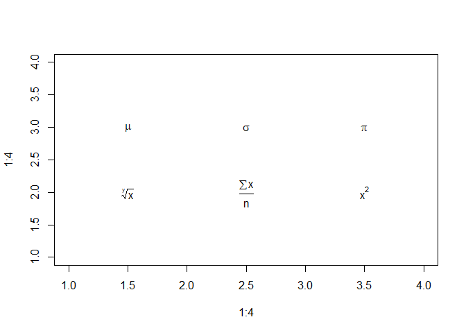<!-- -->

``` r
## Histogram from generated numbers

# Generate random numbers from a normal distribution.
x <- rnorm(mean = 5, sd = 1, n = 50)

# Create a histogram with a title, indicating the mean and standard deviation.
hist(x, main = expression(paste("Sampled values, ", mu, " = 5, ", sigma, " = 1")),
     col = "lightblue")
```

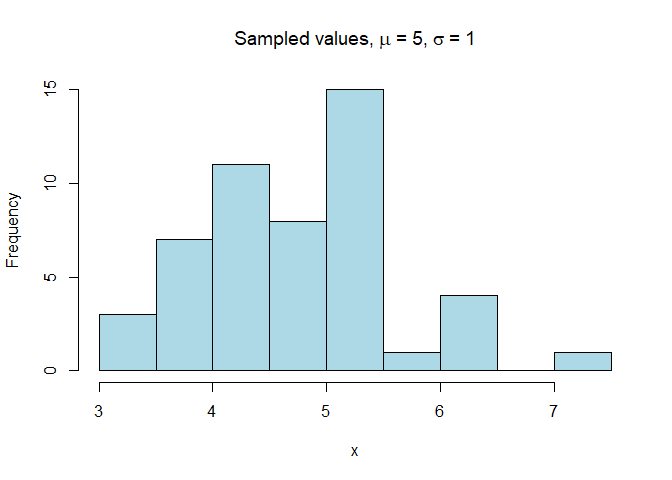<!-- -->

``` r
## Basic Plot

# Create dataframe from the data file
data <- read.csv("https://github.com/mydatastory/r_intro_class/raw/master/data/gapminder.csv")

us  <- data[data$country=="United States",]#subset(data, country == "United States")

# Plot GDP per Capital by year.
plot(us$year, us$gdpPercap,
     xlab = "Year",
     ylab = "GDP per Capital",
     type = "b", 
     cex  = .75,
     lty  = 3,
     col  = "red",
     pch  = 1)
```

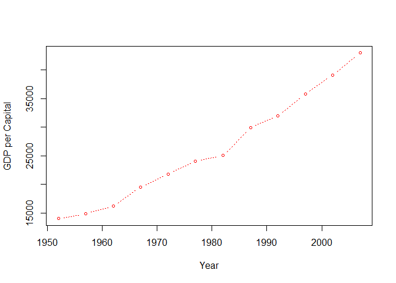<!-- -->

``` r
## Multi Line Plot

# Create vectors, one for each country represented.
uk         <- data[data$country=="United Kingdom",]#subset(data, country == "United Kingdom")

x <- us$year
y <- us$gdpPercap

plot(x, y,
     xlab = "Year",
     ylab = "GDP per Capital",
     type = "b", 
     cex  = .75,
     lty  = 3,
     col  = "blue",
     pch  = 1,
     las  = 1,
     cex.axis = .60)

x <- uk$year
y <- uk$gdpPercap

# Now plot the UK line, using a different color and line type.
lines(x, y, type = "b", lty = 2, col = "red", pch = 0, cex = .75)

# Add legend to distinguish between the two lines.
legend("bottomright",
       title = "Race",
       c("United States","United Kingdom"),
       lty   = c(3, 2), 
       pch   = c(1, 0),
       col   = c("blue","red"))
```

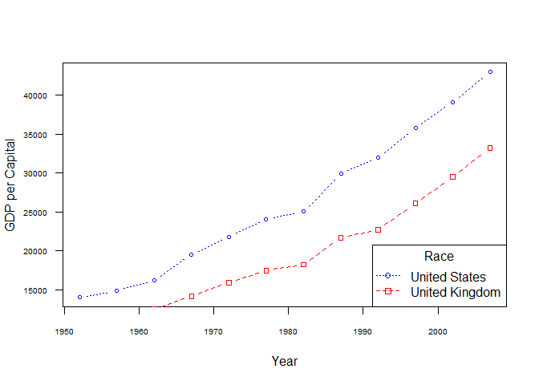<!-- -->

``` r
## Histogram

# Create dataframe from data file.
life_exp_1987 <- data[data$year==1987,]
life_exp_2007 <- data[data$year==2007,]

# Create two vectors, one for each stature factor.


# Set graphic device parameters to 2 rows and 1 column.
par(mfrow = c(2, 1))    

# Graph the two vectors.
hist(life_exp_1987$lifeExp, main = "Life Expectancy in 1987", 
     xlab = "Life Expectancy", xlim = range(30:90), col = "lightblue")
hist(life_exp_2007$lifeExp, main = "Life Expectancy in 2007", 
     xlab = "Life Expectancy", xlim = range(30:90), col = "lemonchiffon")
```

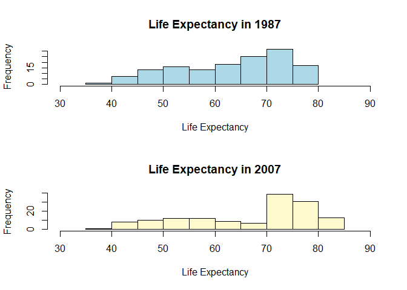<!-- -->

``` r
# Restore graphic device to 1 row, 1 column.
par(mfrow = c(1, 1))  


## Boxplot

# Two ways to create the boxplot.
# Create with filter data
boxplot(life_exp_1987$lifeExp, life_exp_2007$lifeExp, 
        names = c("1987","2007"), col = "rosybrown1")
```

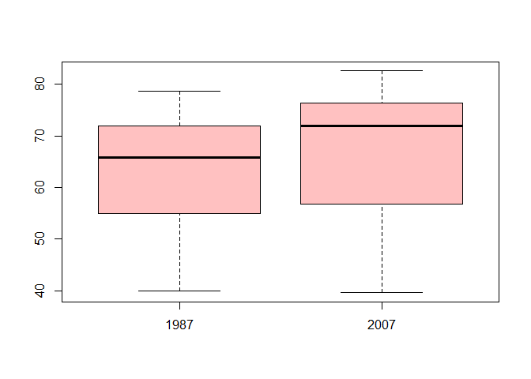<!-- -->

``` r
boxplot(data$lifeExp ~ data$year, 
        data[data$year==1987|2007,], col = "rosybrown1")
        
# Create with formula (all years)
boxplot(data$lifeExp ~ data$year, col = "rosybrown1")
```

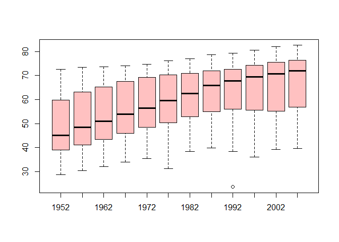<!-- -->

``` r
## Make a Table

continents <- data[,c("country","continent")]
continents <- unique(continents)
cont_table <- table(continents$continent)
cont_table
```

    ## 
    ##   Africa Americas     Asia   Europe  Oceania 
    ##       52       25       33       30        2

``` r
## Basic barplot
set.seed(1234)
rows_for_barplot <- data[sample(nrow(data), 6), ]

barplot(rows_for_barplot$lifeExp, 
        names.arg = paste0(rows_for_barplot$country, "\n", rows_for_barplot$year),
        col = rainbow(6, s = 0.3),
        ylab = "Life Exp (Years)",
        ylim = c(0,80))
```

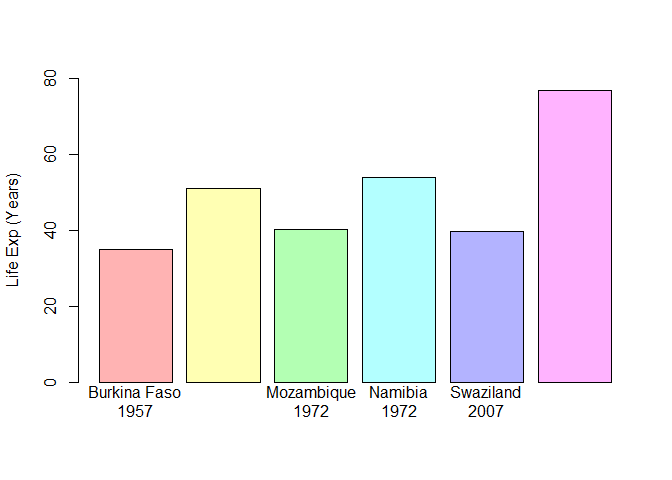<!-- -->

``` r
## Stacked and grouped barplots

library(dplyr)
```

    ## 
    ## Attaching package: 'dplyr'

    ## The following objects are masked from 'package:stats':
    ## 
    ##     filter, lag

    ## The following objects are masked from 'package:base':
    ## 
    ##     intersect, setdiff, setequal, union

``` r
# Remove Oceania because it only has a sample size of 2 (New Zealand and Australia)
pop_2007 <- dplyr::filter(data, year == 2007, continent != "Oceania")
pop_2007 %>% group_by(continent) %>% summarise(sum(pop))
```

    ## # A tibble: 4 x 2
    ##   continent `sum(pop)`
    ##   <fct>          <dbl>
    ## 1 Africa     929539692
    ## 2 Americas   898871184
    ## 3 Asia      3811953827
    ## 4 Europe     586098529

``` r
pop_2007 %>% group_by(continent) %>% mutate(cont_pop = cumsum(pop))
```

    ## # A tibble: 140 x 7
    ## # Groups:   continent [4]
    ##    country      year       pop continent lifeExp gdpPercap  cont_pop
    ##    <fct>       <int>     <dbl> <fct>       <dbl>     <dbl>     <dbl>
    ##  1 Afghanistan  2007  31889923 Asia         43.8      975.  31889923
    ##  2 Albania      2007   3600523 Europe       76.4     5937.   3600523
    ##  3 Algeria      2007  33333216 Africa       72.3     6223.  33333216
    ##  4 Angola       2007  12420476 Africa       42.7     4797.  45753692
    ##  5 Argentina    2007  40301927 Americas     75.3    12779.  40301927
    ##  6 Austria      2007   8199783 Europe       79.8    36126.  11800306
    ##  7 Bahrain      2007    708573 Asia         75.6    29796.  32598496
    ##  8 Bangladesh   2007 150448339 Asia         64.1     1391. 183046835
    ##  9 Belgium      2007  10392226 Europe       79.4    33693.  22192532
    ## 10 Benin        2007   8078314 Africa       56.7     1441.  53832006
    ## # ... with 130 more rows

``` r
for (cont in unique(pop_2007$continent)){
  x <- dplyr::filter(pop_2007, continent == cont) %>% top_n(3, pop) %>% droplevels
  
  # Assign the name of the cont as the variable name
  assign(cont, x)
}


# Data must be presented as a matrix or vector for stacked or grouped barplots.

m1 <- cbind(Africa = Africa$pop, Americas = Americas$pop, 
            Asia = Asia$pop, Europe = Europe$pop)
m1
```

    ##         Africa  Americas       Asia   Europe
    ## [1,]  80264543 190010647 1318683096 61083916
    ## [2,]  76511887 108700891 1110396331 82400996
    ## [3,] 135031164 301139947  223547000 71158647

``` r
xx <- rep(0,3)
aa <- Africa$pop
bb <- Americas$pop
cc <- Asia$pop
dd <- Europe$pop
m2 <- matrix(c(aa,xx,xx,xx,
               xx,bb,xx,xx,
               xx,xx,cc,xx,
               xx,xx,xx,dd), ncol = 4)
colnames(m2) <- c("Africa", "Americas", "Asia", "Europe")

m2
```

    ##          Africa  Americas       Asia   Europe
    ##  [1,]  80264543         0          0        0
    ##  [2,]  76511887         0          0        0
    ##  [3,] 135031164         0          0        0
    ##  [4,]         0 190010647          0        0
    ##  [5,]         0 108700891          0        0
    ##  [6,]         0 301139947          0        0
    ##  [7,]         0         0 1318683096        0
    ##  [8,]         0         0 1110396331        0
    ##  [9,]         0         0  223547000        0
    ## [10,]         0         0          0 61083916
    ## [11,]         0         0          0 82400996
    ## [12,]         0         0          0 71158647

``` r
barplot(m2, 
        legend = cbind(levels(Africa$country), levels(Americas$country), 
                       levels(Asia$country), levels(Europe$country)),
        col = rainbow(12, s = 0.5),
        beside = F)
```

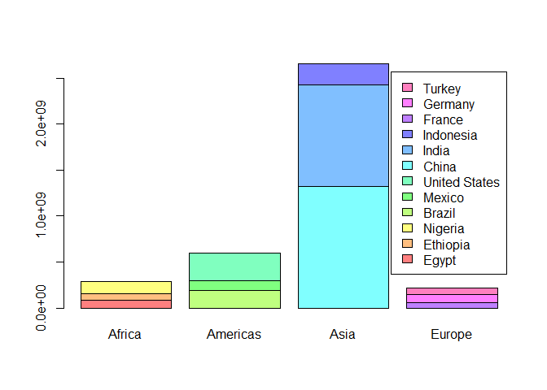<!-- -->

``` r
barplot(m1, 
        legend = cbind(levels(Africa$country), levels(Americas$country), 
                       levels(Asia$country), levels(Europe$country)),
        col = rainbow(12, s = 0.5),
        beside = T)
```

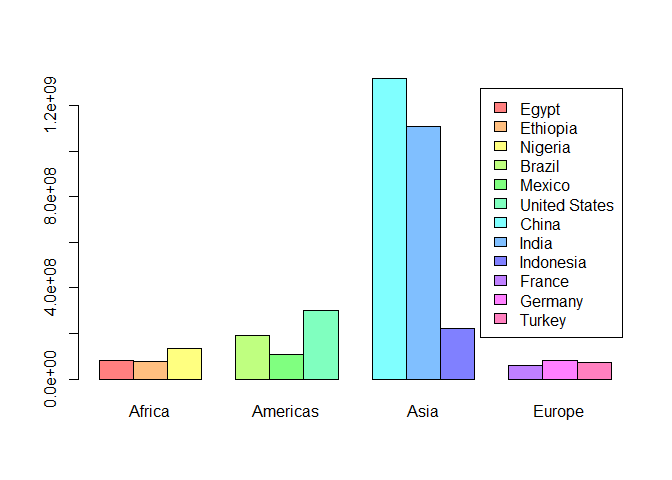<!-- -->

``` r
## Pie Chart

cont_table
```

    ## 
    ##   Africa Americas     Asia   Europe  Oceania 
    ##       52       25       33       30        2

``` r
lbls <- paste0(names(cont_table), "\n ", cont_table)
pie(cont_table, labels = lbls, main = "Pie Chart of Continents\n (number of countries)")
```

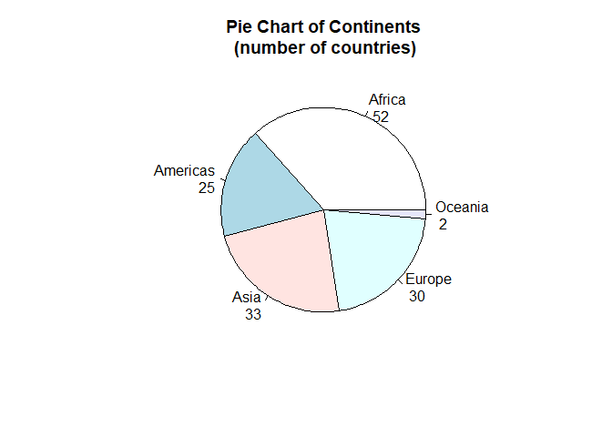<!-- -->

``` r
## Scatter Plot

data_2007 <- data[data$year==2007,]
plot(data_2007$gdpPercap, data_2007$lifeExp, xlab = "GDP Per Capital ($)", ylab = "Life Expectancy (Years)")
```

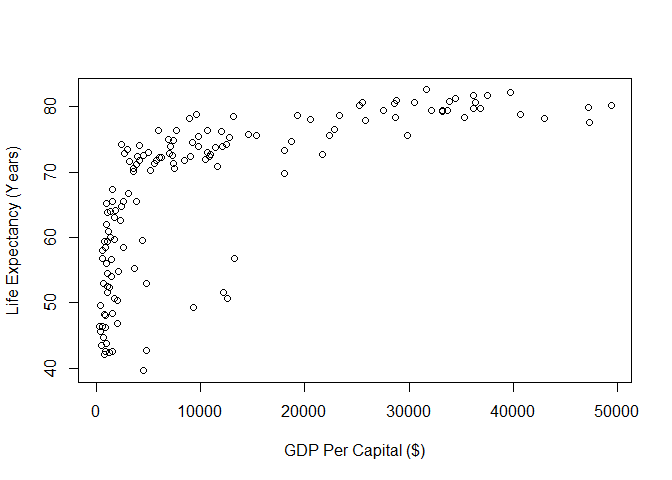<!-- -->

``` r
## Stem and Leaf Plot

# The scale argument must equal 2 or the function only prints even numbers.  This
# is not stated in the help documentation.  The answer was found on Stack Overflow.

stem(data_2007$lifeExp, scale = 2) 
```

    ## 
    ##   The decimal point is at the |
    ## 
    ##   39 | 6
    ##   40 | 
    ##   41 | 
    ##   42 | 14667
    ##   43 | 58
    ##   44 | 7
    ##   45 | 7
    ##   46 | 2459
    ##   47 | 
    ##   48 | 233
    ##   49 | 36
    ##   50 | 477
    ##   51 | 56
    ##   52 | 3599
    ##   53 | 
    ##   54 | 158
    ##   55 | 3
    ##   56 | 0779
    ##   57 | 
    ##   58 | 046
    ##   59 | 4457
    ##   60 | 09
    ##   61 | 
    ##   62 | 17
    ##   63 | 18
    ##   64 | 127
    ##   65 | 2556
    ##   66 | 8
    ##   67 | 3
    ##   68 | 
    ##   69 | 8
    ##   70 | 2367
    ##   71 | 02347889
    ##   72 | 023445568899
    ##   73 | 003479
    ##   74 | 00122579
    ##   75 | 0356667
    ##   76 | 24445
    ##   77 | 69
    ##   78 | 1233466789
    ##   79 | 3444588
    ##   80 | 022577799
    ##   81 | 278
    ##   82 | 26
